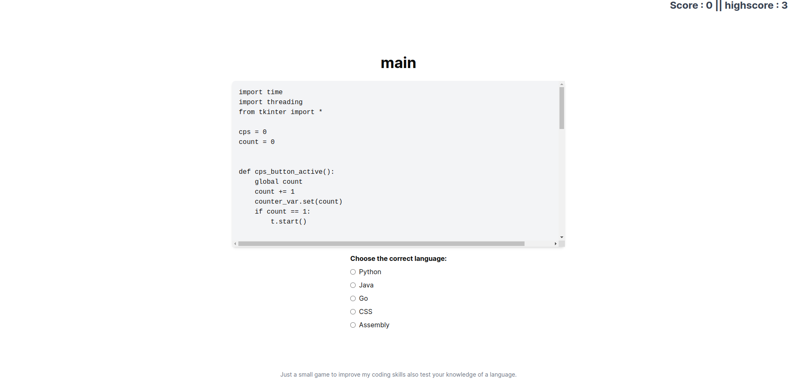

# Play Guessing Game with programming languages

## Hey there! I am Rasla. I am good at coding ( i think :) )

I am a software engineer and I love to code. i do some programming projects in my leisure time. Okay let's talk about this project.

## What is this project about?

This project is about to play a guessing game with programming languages. I use Nextjs 14 for this project. Its a latest version of Nextjs, also i need to learn it right ?. so i decided to do this project with Nextjs 14.

## Let's talk about the logic i used in this project.

The logic is simple.

1. I prepared 3 api end points here. those are `/gists/fetch`, `/gists/format` and `/gists/random`.

   - `/gists/fetch` is used to fetch the gists from github. it will return a json object with the gists. 30 gists are fetched from github.
   - `/gists/format` is used to format the gists.it will create new json files in a folder called gists with proper format to use in the game.
   - `/gists/random` is used to get a random gist from the gists folder. we use this api to get a random gist to play the game from client side.

2. I created a `/gists` folder in the root directory of the project. this folder will contain all the gists.

### How to run this project?

1. Clone the project.
2. Install the dependencies.
3. Run the project.

```bash
git clone git@github.com:0xrasla/guess-the-code-game.git
cd play-guessing-game-with-programming-languages
bun i # use npm i if you are using npm
bun dev # use npm run dev if you are using npm
```

### How to play the game?

1. Open the browser and go to `http://localhost:3000/`.
2. You will see a random gist data shown in the browser.
   3.Choose the correct answer from the list of answers showd below the gist.
3. If you are correct, you will see a message like `Correct!` and the game will be over.
4. If you are wrong, you will see a message like `Wrong!` and the game will be over.

### Screenshot



### IMPORTANT

- This game is not fully functional. I am still working on it.
- Every gists shown here are from the github gists. its a publicly available gists. you can use it for your own projects.
- I am not responsible for any damages caused by this project.

### How to contribute?

- Fork the project.
- Create a new branch.
- Make your changes.
- Commit your changes.
- Push your changes.
- Create a pull request.

### License

This project is licensed under the MIT License - see the [LICENSE](LICENSE) file for details.

## Thanks

- [Nextjs](https://nextjs.org/)
- [React](https://reactjs.org/)
- [TypeScript](https://www.typescriptlang.org/)

## Author

Rasla, [https://twitter.com/0xrasla](https://twitter.com/0xrasla)

## Contact

If you have any questions or suggestions, feel free to reach out to me at [https://twitter.com/0xrasla](https://twitter.com/0xrasla).
